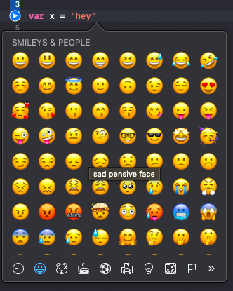

 # Entry 1: Research
 
 As most people do, I use my phone every day. We are constantly using different apps that we do not think about the code that powers these apps. While conducting research about what I could learn for my independent study, I came across Swift. To create my own apps made me realize the power this language holds.
 
 ## What is Swift?
 
 Swift is a programming language developed by Apple to create apps for Apple/ios products including phones (iOS), computers (macOS), tablets (iOS), watches (watchOS), and tvs (tvOS). In my research, I discovered that the most updated version of the language, Swift 5, supports Python, JavaScript, and Ruby, as well as use of APIs. This will be helpful because of my current knowledge of Ruby and APIs. I will be able to incorporate these into my app to make it even more powerful.
 
 
 
 ## Preliminary Tests
 
 I began testing things I found in the documentation archive in the [Apple Developer](https://developer.apple.com/library/archive/referencelibrary/GettingStarted/DevelopiOSAppsSwift/index.html#//apple_ref/doc/uid/TP40015214-CH2-SW1). I learned that to use Swift, I needed to download XCode. XCode is an **I**ntegrated **D**evelopment **E**nvironment for macOS that allows you to develop an app. 
 
 Once downloaded, I had to learn the basics of the interface:


I began following the instructions in the Apple Developer to make a simple meal-tracking app. One of the first steps is to launch the simulator. In XCode, there is a feature that allows you to see the code on a simulated iPhone, which I thought was really cool.


After doing this, however, I realized that this tutorial was too advanced for my minimal understanding of the language. I had not read the section in the documentation that explained the tutorial required familiarity with the Swift programming language. I needed to first get a basic understanding of the language and its syntax.

## Udacity Tutorial

After further research to find a Swift syntax tutorial, I came across a free course to [Learn Swift Programming Syntax](https://www.udacity.com/course/learn-swift-programming-syntax--ud902). This course takes roughly 3 weeks to complete, so I believe this will leave me with enough time to create my own app.

After watching the first few videos of Swift basics, I discovered that a large amount of the syntax is very similar, or the same, as that of other languages like Ruby and Python. 

#### Variables and Constants

**Var** is used to declare _variables_, which is also used in Python.
For example: 

```swift
var x = 3
```

However, Swift also uses _constants_, meaning it can only be assigned a value once. It is defined using **let**. For example:

```swift
let y = 10
```

According to [an article by Paul Hudson](https://www.hackingwithswift.com/example-code/language/whats-the-difference-between-let-and-var), "The reason Swift strongly encourages you to use constants wherever possible is because it's safer: if you say 'this value will never change,' then Swift will refuse to let you change it even by accident. It also opens the possibility of compiler optimizations if the system knows certain data will not change."

#### Operators and Conditionals

Logical and comparison operators remain the same as other languages. **||** is used to indicate OR. **&&** is used to indicate AND.

Ternary conditionals used in Ruby bear the same syntax as in Swift.

```swift
question ? answer1 : answer2
```

Regular conditions bear the same syntax as in JavaScript.

```swift
if question {
  answer1
} else {
  answer2
}
```

#### Strings

Just like other languages, strings are indicated through use of **quotes ("")**. String concatenation is done through use of the **plus symbol (+)**.

```swift
let x = "Hey"
let y = "Bob"
let newString = x + " " + y
// newString would equal "Hey Bob"
```
One difference is that Swift supports Unicode scalar values, meaning you can use emojis in string literals. You can bring up the emoji keyboard by pressing <kbd>Control</kbd> + <kbd>⌘ Command</kbd> + <kbd>Space</kbd>.



String interpolation is done like so:

```swift
let name = "Bob"
let string = "\(name) says hi"
// string would equal "Bob says hi"
```

You can also evaluate math expressions using string interpolation using the same syntax.

## Takeaways

1. Read **everything** before jumping into doing things. Sometimes, it seems more convenient to skim over something, but it may end up misleading you.
2. Try to make connections between what you know and what you are trying to learn. This allows for better retention of new information and a deeper understanding of the concepts.
3. Make your own versions of what you find in tutorials. Test things out and change values because it is best to learn by doing.

[Table of Contents](../README.md)