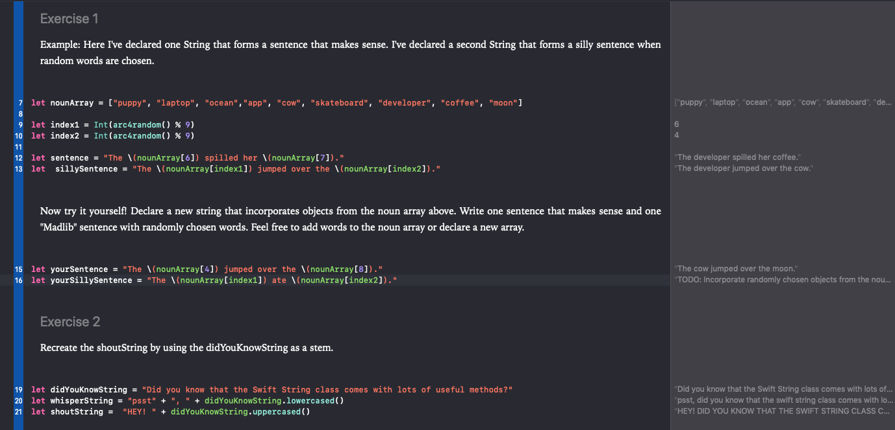

# Entry 2: App Ideas

My goal for this week is to continue learning the syntax for Swift and solidify an app idea

## NSString

Swift bridges to Objective-C's NSString class, meaning that Swift strings have access to NSString methods. Documentation for such methods can be found [here](https://developer.apple.com/documentation/foundation/nsstring).

## Data Types

In Swift, you can indicate the data type of a variable, but the program will also figure out the data type if you choose not to include this.

- **Int (Integer)** - Numerical values, but it cannot include decimal values

```swift
var highScore: Int = 100
```

- **Float** - Numerical values including decimals

```swift
var x: Float = 20.4
```

- **Double** - Numerical values including decimals, but allows for more precision than a float

```swift
var pi: Double = 3.14159265359
```

- **Bool (Boolean)** - Hold a value of _true_ or _false_

```swift
var result: Bool = true
```

- **String** - Any collection of characters

```swift
var y: String = "hello"
```

## Excercises

Upon completion of the first lesson in the Udacity Tutorial, I completed the excercises provided in order to test my newfound knowledge. These excercises allowed me to practice string interpolation, declaration of variables and constants, and other basics explained in the first lesson.

##### Examples:



## Optionals

Nil is disallowed in most Swift types, such as integers or objects. I found this unusual because most other languages allow variables to equal nil. In Swift, however, you must use **the optional type**. Optionals may hold a value, or they may hold nil. When specifying the optional data type, you also indicate the type of data that it might hold (Int, String, etc.). Optionals are indicated using a **question mark (?)**, and the variable must be declared using a **colon (:)**.

```swift
var x: Int?
```

## Loops

Just like all other languages, there are various types of loops you can use in Swift. Most utilize curly brackets like Python.

#### While

_While_ a condition is true, something will happen.

```swift
var i = 1
while i <= 10 {
    print(i)
    i = i + 1
}
```

#### Repeat

_Repeat_ the loop or _while_ a condition is true.

```swift
var i = 1
repeat {
    print(i)
    i = i + 1
} while i < 10
```

**So what's the difference?**

According to [WeHeartSwift](https://www.weheartswift.com/loops/), "The difference between a `while` and a `repeat` loop is that the repeat loop evaluates the condition after executing the statements from the loop."

#### For

A _for_ loops executes some code _for_ each item in a range. Similar to Ruby, Swift also uses range operators, which is a shortcut for expressing a range of values.

```swift
// prints 1-10
for i in 1...10 {
    print(i)
}

// prints 0-9
for i in 0..<10 {
    print(i)
}
```

**Stride Function**

The _stride function_ is unique to Swift. It is used to iterate through a range of numbers by a specified increment and can be used in for loops. Increments can either be positive or negative

```swift
stride(from: 1, to: 10, by: 2)  // 1, 3, 5, 7, 9
for i in stride(from: 3, to: 1, by: -1) {
    print(i)
}
// prints: 3 2 1
```

## Choosing an App

When brainstorming ideas for an app to make, my partner and I came up with a few possible ideas:

- Community service app
- App that connects accepted students within a specifc university
- Moodvie
- Party planning app

We ultimately decided on the community service app. This would connect people who wanted to volunteer with organizations in need of help.

## Takeaways

1. Do further research based on what you find in a tutorial. This will help you understand why something functions the way it does.
2. Learn by doing. Complete exercises and allow time to practice what you have learned to retain information better.

[Previous](../entry01-research.md)

[Table of Contents](../README.md)