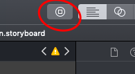
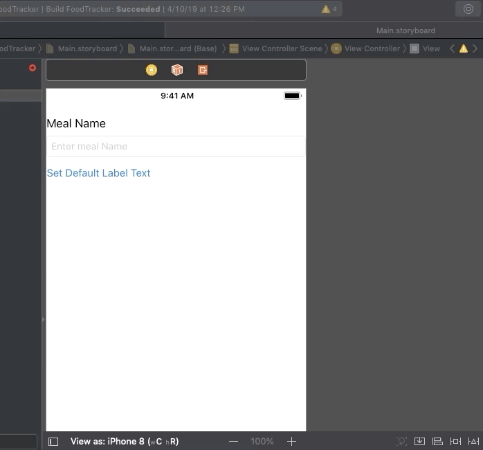
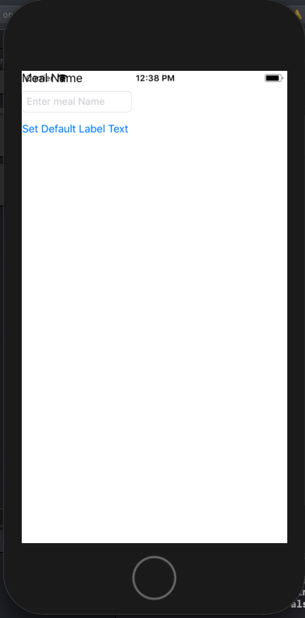
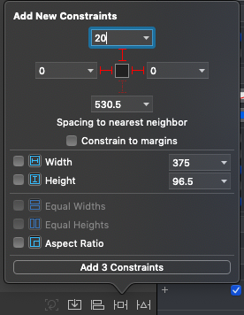
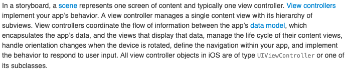

# Entry 3: Simple App

This week I decided to follow a tutorial for a simple one-page app. This would allow me to begin applying the skills I have learned so far. I started by working on the view.

## View

In order to add things to the view, or display them on the screen, you press this button on the right side of the toolbar:

Adding things to the display is actually very simple, as it does not require any actual coding. When pressing the button shown above, you can then choose what you would like to add to the view. You simply drag and drop like so:

#### Tutorial

The [tutorial](https://developer.apple.com/library/archive/referencelibrary/GettingStarted/DevelopiOSAppsSwift/index.html#//apple_ref/doc/uid/TP40015214-CH2-SW1) I followed on Apple Developer is to make a simple meal-tracking app that I mentioned in [entry one](entry01-research.md). I began by following the instructions for adding simple items to the view, including a title, input box, and button.

As you can see in the image, however, the items on the display are overlapping the toolbar at the top of the screen. The items also do not format correctly if you change the phone size or orientation. To fix this, I had to use constraints.

##### Constraints

Constraints allow you to contain items placed in the display to specific lengths and widths. This makes it responsive to different phones and orientations.

## Connecting it to Code

Now that I  have a simple _user interface (UI)_ to work with, my next steps are to begin connecting it to code to make the app interactive. The tutorial included this explanation for the relationship that a storyboard has to the code:

To summarize, the sections of the UI and source code work together to controls, displays, and the app's behavior.

## Takeaways

1. Start simple. It is best to take small steps at a time so you can slowly build your knowledge before ultimately creating a larger project.
2. Test as you learn. Before learning everything, you can give yourself small projects. Then you can learn what tools you need so you do not waste time.
3. Summarize long explanations/definitions in your own words. This demonstrates a greater understanding of the concepts and provides you with a more concise explanation to look back on.

[Previous](entry02-week2.md) | [Next](entry04-week4.md)

[Table of Contents](../README.md)