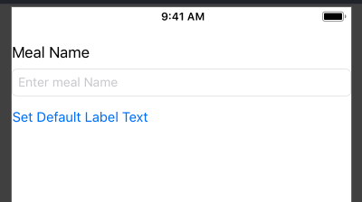

# Entry 4: Workflow

My goal for this week was to continue learning about the workflow for developing an app.


## Changing the Constraints

The tutorial had me add constraints on the left and right sides of the items in the display with margins of 0. When looking at the result, however, I did not like how close everything was to the edges of the screen:



I adjusted the margins to 10 instead of 0, so there was a little space betweent the items and the edge of the screen:


## Connecting the UI to Code

Last week, I did not finish connecting the user interface (UI) to code in order to make it interactive, so I used this week to learn how to do so. The tutorial first had me add the following comment:

```swift
//MARK: Properties
```

It gave the following explanation:


I felt that this explanation was simple enough for me to understand.

To connect specific items from the view, you open the file ViewConroller.swift and <kbd>Control</kbd> + drag the item into a class within the code. This inputs the following line of code into the file:

```swift
 @IBOutlet weak var nameTextField: UITextField!
```

I was very confused about what this line of code did, and the tutorial (along with some googling) helped me understand the following:

- The **IBOutlet** attribute tells Xcode that the nameTextField property (text box) can connect to the Interface Builder (hence the IB prefix)
- The **weak** keyword indicates that it does not prevent the program from deleting the memory associated with that object. To keep it in memory, another part of the app must use a strong reference, which in this case, is the text field’s superview.
- A **superview** maintains everything in the memory, as well as anything in the subviews.
- Similarly, the **view controller** has a strong reference to its content view, so everything is kept in memory.
- The rest of the line defines the variable of type UITextField named nameTextField.
- The **exclamation point** indicates that the type is an implicitly unwrapped optional, which is an optional type that will always have a value after it is first set. When accessed, the program assumes it has a valid value and automatically unwraps it for you. Note that this causes the app to terminate if the variable’s value has not yet been set.

I then connected the label to the code like so:

```swift
 @IBOutlet weak var mealNameLabel: UILabel!
```
The only difference between this line of code and the previous one is the name and type.

In order to connect the button to the code, I had to define an action.

## Event-Driven Programming

iOS apps are based on event-driven programming, meaning the flow of the app is determined by events: system events and user actions. The user performs actions that trigger events. The app's response then reflects back to the user interface.

- An **action** (or action method)  is a piece of code that is linked to an event that can occur in your app. When that event takes place, the system executes the action’s code.

#### Defining an Action

To define an action for the button, I first included the following comment:

```swift
//MARK: Actions
```

This indicates that this section of code lists actions.

I used the same <kbd>Control</kbd> + drag method with the button, which set up this action method:

```swift
@IBAction func setDefaultLabelText(_ sender: UIButton) {
}
```

- The **sender** parameter refers to the object that was responsible for triggering the action—in this case, a button. 
- The **IBAction** attribute indicates that the method is an action that you can connect to from your storyboard in Interface Builder. 
- The rest of the declaration declares a method by the name of setDefaultLabelText(_:).

I added this between the curly brackets:

```swift
mealNameLabel.text = "Default Text"
```

This code sets the label’s text property to Default Text.

I tested this in the simulator, which produced this result:


As you can see, the button click changes the label from "Meal Name" to "Default Text".


## Takeaways

1. Change things to how you like it, even if it is different from a tutorial you are following. There is not always one set way to do things, so you should make modifications based on what you think looks or functions best.
2. Reword things and use google until you fully understand an explanation. There is no use in skipping over the understanding part because you are only doing yourself a disservice by skipping over the knowledge.
3. Test things out along the way. This makes it easier in the future when you are trying to solve a problem because you will know what was working previously.

[Previous](entry03-week3.md) | [Next](entry05-week5.md)

[Table of Contents](../README.md)