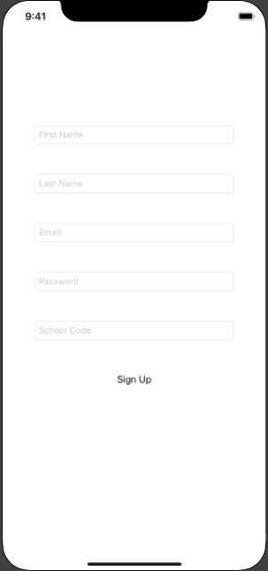

# Entry 5: Starting my App

Feeling like I was running out of time, I decided to begin working on the final app my partner, Raquel, and I will create.

### The Idea

We decided it would be best to create a very simple app because our time to do so is limited. To come up with an idea, we asked our friends for some ideas by inquiring about what app would benefit their lives. Our friend gave us the idea to create an app that allows school clubs to fundraise online by selling products to students and tell them where to pick up their purchased items. It will be called **Clubraising**.

### The View

The simplest place to start with this app was the view. Because the app would have different pages for faculty (the ones selling the items) and students (the ones buying the items), Raquel and I split up this work. She worked on the student view, and I worked on the faculty view. 

I began by creating this simple view to sign up as a faculty member in order to sell for a certain club:

While I am not completely happy with the look, I will return to it later to fix it. I began to get frustrated at this point because I could not figure out how to change the page when the button is clicked. I need to continue working on this, and I cannot let myself give up even though I am struggling to make this aspect work. 

### Next Steps

My next steps are to continue researching how to change the page and fix the view to make it look how my partner and I want it to.

# Takeaways

1. Ask your friends for help. It is beneficial to get outside opinions and ideas because we often get stuck within ourselves and our own projects. This helps you step away from yourself and see something you would not have otherwise.
2. It is ok if you cannot figure something out. As long as you perservere and do not give up on trying to solve the issue, you will find a way to make it work.

[Previous](entry04-week4.md)

[Table of Contents](../README.md)