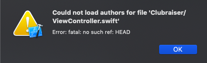
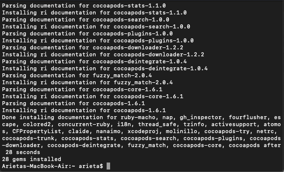

# Entry 6: Error

## Multiple Views

By asking my partner for help, I was able to learn how to create multiple views that connect to one another. All I had to do was add a new view, then <kbd>control</kbd> + drag from one view to the other. When I realized it was that simple, my face was like this:

At the beginning of the week, everything was working fine, and I was able to create my view, but I unexpectedly ran into an error making it impossible to load my files. This is the error I received, and it occurred with any file I attempted to open:

I did not know what this meant, so I had to google the issue.

1. I began my search with "swift could not load authors for file".
2. I first clicked on [stack overflow](https://www.google.com/search?safe=strict&rlz=1C5CHFA_enUS759US759&ei=5qrVXN_bCI2l_Qb3j5KAAg&q=swift+could+not+load+authors+for+file&oq=swift+could+not+load+author&gs_l=psy-ab.1.0.33i22i29i30l6.22102.26448..28238...0.0..1.432.1809.18j2j4-1......0....1..gws-wiz.......0j0i22i30.5socNKetylo). This seemed to be talking about merge conflicts, however, so this link did not help me.
3. The previous link, as well as this [link](https://github.com/CocoaPods/CocoaPods/issues/763), both discussed pod installation. Although I did not exactly know what this meant, I adjusted my search to "xcode pod install".
4. I followed the directions given by the user from [stack overflow](https://stackoverflow.com/questions/20755044/how-to-install-cocoapods) to install pods.

I opened Terminal and typed in the command: `sudo gem install -n /usr/local/bin cocoapods`. It installed 28 gems:

However, my issue still was not solved.

5. I then adjusted my search again to "xcode unable to load author information" and found [this link](https://stackoverflow.com/questions/51053831/xcode-cant-check-who-to-blame-information). I tried to follow the information and play around with Terminal, but I still had no luck solving the problem.

# Takeaways
1. Ask your friends for help. There is no harm in reaching out to your peers, and you will discover that there is a lot to learn from one another.
2. Adjust your search in Google to help you best find the result you are looking for.

[Previous](entry05-week5.md)

[Table of Contents](../README.md)