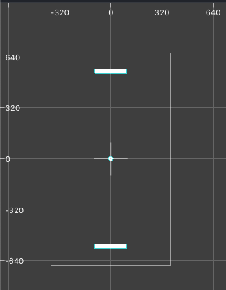
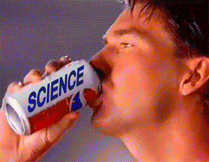

# Entry 8: Pong

My partner and I decided to make the game pong because although it is not original, it is simple enough for us to create and understand.

## Tutorial

We found a 4-part [tutorial](https://www.youtube.com/watch?v=LdL99CH23E8) on YouTube to code pong. I began working on the first part, which included the basic functions of the moving ball and the ability for the user to move the paddle with their finger.

I first created a new project called "Pong", but this time the app type is a game. In the scene, I added two rectangles for the paddles and a circle for the ball and placed them in their respective positions using x and y coordinates. The outcome was this:

Next, I had to add physics definition to each sprite (or object). I was excited about this because I am currently taking AP Physics, so I was able to understand the terms used.

Using the [Apple documentation](https://developer.apple.com/documentation/spritekit), for SpriteKit specifically, I was able to define the following terms:

- **Restitution** is the bounciness of the object. It determines how much energy is lost when it bounces off another object. The value must be a number between 0.0 and 1.0.
- **Friction** is the roughness of the surface of the object.
- **Linear Damping** reduces an object’s linear velocity by simulating fluid and air friction forces. The value must be a number between 0.0 and 1.0.
- **Angular Damping** reduces an object’s rotational velocity by simulating fluid and air friction forces. The value must be a number between 0.0 and 1.0.
- The property **isDynamic** is a boolean, or true or false, value that determines whether all forces and impulses applied to an object should be ignored.
- The method **applyImpulse** applies an impulse to the center of gravity of an object _(Impulse- A vector measured in Newton-seconds that describes how much momentum was imparted in each dimension)_.

I was able to complete the basic functions of the game where the ball bounces off each paddle. My partner then added the score variable to the file and made the game repeat after each win/loss. I then added the labels to the view to display the score.

# Takeaways

1. Divide and conquer. When working with a partner, it is best to make a plan for who will complete each aspect of the project in order to split up the workload.
2. Connect your prior knowledge to what you are working on currently. It will give you a greater understanding of the topic.

[Previous](entry07-week7.md)

[Table of Contents](../README.md)