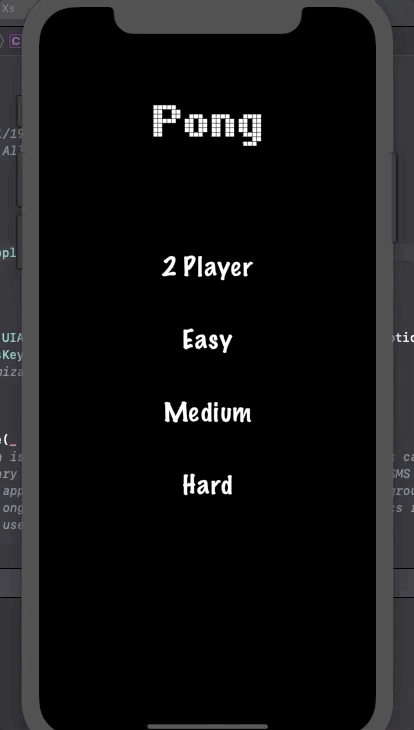

# Entry 9: Finishing Pong

This week, we finally finished Pong!

## What We Added

After completing the MVP of the app with the basic functions working, my partner and I began adding different settings (easy, medium, hard, two players). To do so, we had to add another view to create a selection page. The buttons on this page then had to connect to the game view and alter certain variables according to the setting selection.

This is the selection screen:

## Two Player

When creating the two player setting, I had to change the movement of the paddles. Conditionals had to be used in order to determine which part of the screen was being touched. This accounts for the control of each paddle because the users touch opposite sides of the screen. The code looks like this:

Here, it first checks if the setting is two players. Then, the next conditional checks if the location is above or below the center of the screen (0,0). According to that, it will move either the paddle on the bottom (main) or the top (enemy). Otherwise, it will only move the bottom paddle and the other one will be controlled by the computer.

Gameplay:

## Difficulties

I added three difficulties: easy, medium, and hard so the game would have more features. To do so was simple because I just had to add a conditional and change the time it takes for the enemy paddle to move:

## Responsiveness

Using constraints, I centered all of the labels and buttons on the selection screen for all device sizes. I also used the bounds of the screen to make everything in the app adapt to screens of all different sizes. While the size of the labels and sprites do not adjust, I was able to make everything remain in its correct position. 

Here is gameplay on an iPad:

# Takeaway

1. Once you have an MVP, you have the opportunity to add more features. You can improve your work if you have time because you know there is already a working version.

[Previous](entry08-week8.md)

[Table of Contents](../README.md)